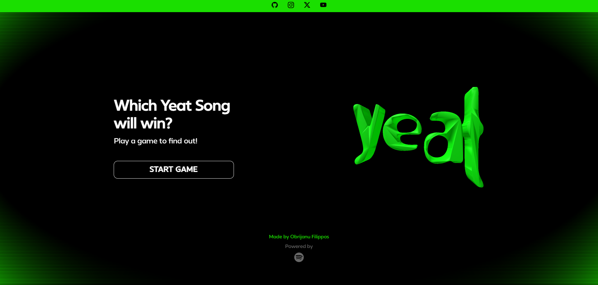
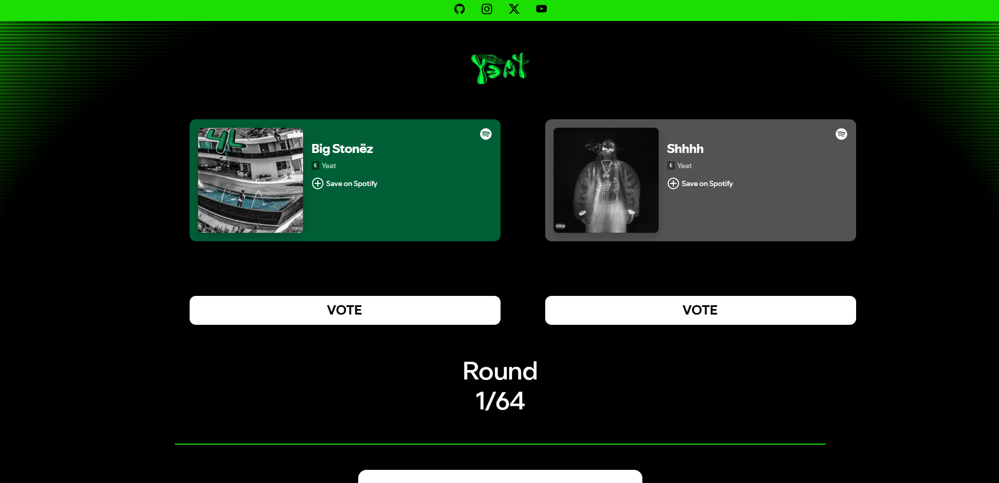

# 💿 Yeat Song Battle App

[](https://filipposobrijanu.github.io/Song-Battle-App)
[](https://opensource.org/licenses/MIT)

A web-based, interactive song-ranking application that pits tracks from Yeat’s discography against each other in a head-to-head voting format. Through iterative rounds of voting, the system dynamically narrows down the selections to crown a definitive fan-favorite track.



## ✨ Core Features

*   **Head-to-Head Matchups:** Dynamically serves two randomly selected tracks (spanning albums, EPs, and singles) for the user to vote on.
*   **Spotify API Integration:** Fetches accurate, up-to-date track data directly from Spotify.
*   **Real-Time State Tracking:** Progressively filters and tracks winning songs through tournament-style brackets.
*   **Responsive UI:** Fully optimized for both desktop and mobile viewing using Bootstrap 5.

## 🛠️ Built With

<p align="left">
  
  
  
  
  
</p>



## 🚀 Getting Started (Local Development)

To run this project locally on your machine, follow these steps:

1. **Clone the repository:**
```bash
   git clone [https://github.com/filipposobrijanu/Song-Battle-App.git](https://github.com/filipposobrijanu/Song-Battle-App.git)
